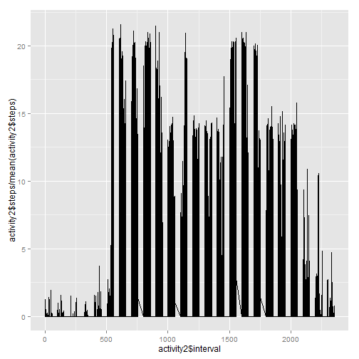
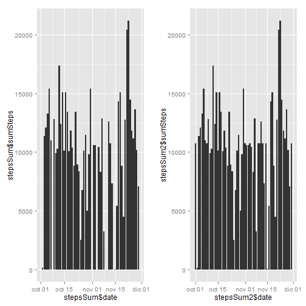
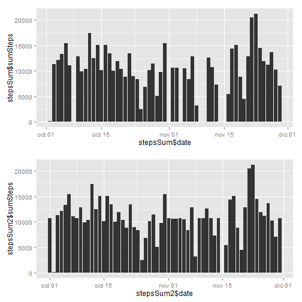
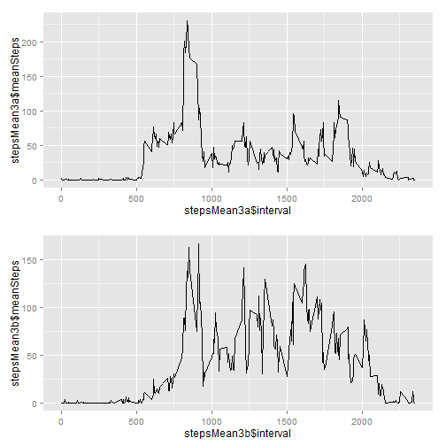

# Quick Introduction

This is an R Markdown document describing the first peer assignment for the Coursera activity.

This assignment requires three libraries:

```r
library("dplyr");
library(grid);
library(ggplot2);
```

After loading them, it's important to consider the dataset on the working directory, which is easily retrieved with **getwd()**, for simplicity, this document will make assumption on having all files on working directory.


```r
getwd()
```

```
## [1] "B:/Documents/R/RepData_PeerAssessment1"
```

I generated two variables, **activity**, and **activity2**, the first one will stay as a table and the second as a dataframe without all the NA values.


```r
activity<-read.csv("~/R/datos/activity.csv");
activity2<-na.omit(activity);
activity2$date<-as.Date(activity2$date);
activity2<-as.data.frame(activity2);
```

Next, I group by two variables:
- interval
- date


This allows me to use the **sumarise()** function quickly enough. It's important to notice that names need to be changed, since the default name given to the set is  **function(Argument)** which is not very compatible.


```r
stepsIntMean<-summarise(activity2Int, mean(steps));
stepsMean<-summarise(activity2, mean(steps));
stepsMedian<-summarise(activity2, median(steps));
stepsSum<-summarise(activity2, sum(steps));
names(stepsSum)<-c('date', 'sumSteps');
names(stepsMean)<-c('date', 'meanSteps');
names(stepsMedian)<-c('date', 'medianSteps');
```

Next I plot the total number of steps per date:


### Averaged across all days by 5 min intervals
Finally, I use the dataset required as distributing the steps per interval

 

And obtaining which row is the one with highest values

```r
maxRow<-which.max(activity2$steps);
activity2[maxRow,];
```

```
## Source: local data frame [1 x 3]
## Groups: date
## 
##   steps       date interval
## 1   806 2012-11-27      615
```


### Input Missing Values
Calculate and report total number of rows with Nas, and prepare a new variable

```r
nas<-sum(is.na(activity2$steps));
areNas<-activity[is.na(activity$steps),];
activity4<-activity;
```

#### Using a 'Fill-em-up' method
Where the average number of steps per interval replace the NA's for the appropiate interval, unless there's a step mean for the current date. I used a for loop for convenience, but lapply can also be used.


```r
for(i in 1:dim(activity4)[1]){
        #### Create a numbers variable with the value, first search mean by date
        if(is.na(activity4[i,'steps'])){
                numbers<-as.numeric(stepsMean[stepsMean$date==as.Date(activity4[i,'date']),][2]);
                #### If the mean by date returns NA, then replace with the mean by interval 
                if(is.na(numbers)){
                        numbers<-as.numeric(stepsIntMean[stepsIntMean$interval==activity4[i,'interval'],][2]);
                }
                activity4[i,'steps']<- numbers;
        }
        
}
```

#### There's a big possible bias with this method
Since analyzing it is not the scope, well compare it with side by side plots.

## Similar dataset with different values fixed for missing elements.
This is going to be used for comparing values.


```r
activity4$date<-as.Date(activity4$date);
activity4<-as.data.frame(activity4);
activity4<-group_by(activity4, date);
activity4Int<-group_by(activity4, interval);
stepsIntMean<-summarise(activity4Int, mean(steps));
stepsMean2<-summarise(activity4, mean(steps));
stepsMedian2<-summarise(activity4, median(steps));
stepsSum2<-summarise(activity4, sum(steps));
names(stepsSum2)<-c('date', 'sumSteps');
names(stepsMean2)<-c('date', 'meanSteps');
names(stepsMedian2)<-c('date', 'medianSteps');
p2<-qplot(x=stepsSum2$date, y=stepsSum2$sumSteps, geom = 'histogram', stat='identity');
```

## New Plotting Function
Before I proceed, I need to define a **new function to use with multiplots** in ggplot2.
Normally, this would be at the bottom of a *.R file, but here I define it before hand.

```r
multiplot <- function(..., plotlist=NULL, file, cols=1, layout=NULL) {
        library(grid)
        # Make a list from the ... arguments and plotlist
        plots <- c(list(...), plotlist)
        numPlots = length(plots)
        # If layout is NULL, then use 'cols' to determine layout
        if (is.null(layout)) {
                # Make the panel
                # ncol: Number of columns of plots
                # nrow: Number of rows needed, calculated from # of cols
                layout <- matrix(seq(1, cols * ceiling(numPlots/cols)),
                                 ncol = cols, nrow = ceiling(numPlots/cols))
        }
        if (numPlots==1) {
                print(plots[[1]])        
        } else {
                # Set up the page
                grid.newpage()
                pushViewport(viewport(layout = grid.layout(nrow(layout), ncol(layout)))) 
                # Make each plot, in the correct location
                for (i in 1:numPlots) {
                        # Get the i,j matrix positions of the regions that contain this subplot
                        matchidx <- as.data.frame(which(layout == i, arr.ind = TRUE))
                        print(plots[[i]], vp = viewport(layout.pos.row = matchidx$row,
                                                        layout.pos.col = matchidx$col))
                }
        }
}
```

## Comparing Non Na's with filled in values.

### Side by side
 

### Up and Down
 

## Get the correspondind workdays in any language...
I use a new column as vector for the date values of the original table, then translate them into **weekend** or **weekdays**, and finally, I bind the columns with the data set **activity4** which is the one with the filled in data instead of NA's 


```r
days<-weekdays(as.Date(activity[,'date']));
dayseq <- seq(as.Date("2015-08-17"), by=1, len=7);
dayseq <- weekdays(dayseq);
for(i in 1:length(days)[1]){
        ##convert to two factor
        if((days[i]== dayseq[6]) | (days[i]==dayseq[7])){
                days[i]<-'weekend';
        }
        else{
                days[i]<-'weekday';
        }
}
activity4<-cbind(activity4,days);
```


## Weekends vs Weekdays
Then I use the same procedure as before to get two plots, one for weekends and other for weekdays.


```r
activity4<-cbind(activity4,days);
activity4Day <- subset(activity4, days =='weekday');
activity4End <- subset(activity4, days =='weekend');
activity4Day<-group_by(activity4Day, interval);
activity4End<-group_by(activity4End, interval);
stepsMean3a<-summarise(activity4Day, mean(steps));
stepsMean3b<-summarise(activity4End, mean(steps));

names(stepsMean3b)<-c('interval', 'meanSteps');
names(stepsMean3a)<-c('interval', 'meanSteps');

q1<-qplot(x=stepsMean3a$interval, y=stepsMean3a$meanSteps, geom = 'line', stat='identity');
q2<-qplot(x=stepsMean3b$interval, y=stepsMean3b$meanSteps, geom = 'line', stat='identity');
```


And the final plots:
 


